# StyleWithUs
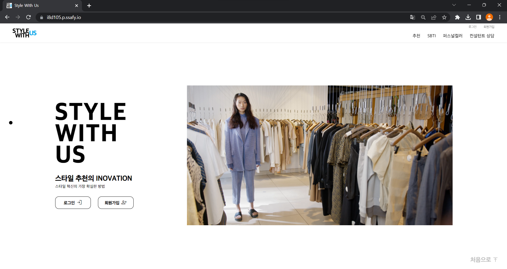

> __아직 배고프조(D105)__  
이병수, 양서정, 이동엽, 김현진, 박재현, 박성환

> __개발 기간__: 2023.01.03 ~ 2023.02.17 (약 7주) 

 

### UCC ➡ [중간 유튜브 링크](https://www.youtube.com/watch?v=R9kV4YRFwxk), [최종 유튜브 링크](https://www.youtube.com/watch?v=F8I9JapLg4k)
### 발표자료 ➡ [중간 발표자료 링크](/docs/발표자료/D105_중간발표자료.pdf), [최종 발표자료 링크](/docs/발표자료/최종발표.pdf)
### Notion ➡ [노션 링크](https://www.notion.so/D105-a32f3c0d0d6644bbaa9afed10fb68d7f)

 

---

 

## 기획 배경 및 목표
> 소개팅이 있는 날, 중요한 발표가 있는 날 같이 스타일링이 필요할 때
> 혹은 매일 같은 옷을 입는다는 소리를 듣거나 공대룩만 입는다는 소리를 듣는 사람들을 위해
> 전문가와의 상담을 통해 자신의 체형에 맞는 옷을 실제 상품에 기반하여 추천해 주는 서비스

 

## 기대 효과
- 유저 체형에 맞는 옷 추천 서비스
- 유저-컨설턴트 간의 1:1 실시간 화상 채팅
- 사진 업로드를 통한 퍼스널 컬러 자가진단

 

## 기술 스택 & 아키텍쳐
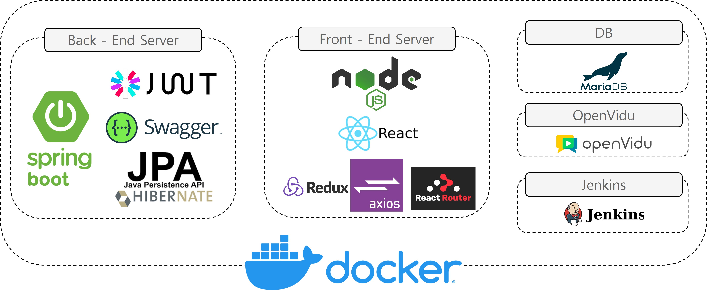
 
 

### Front-End

	
	
	
    
	

### Back-end

	
	
    
	
    
	

### TEAM Cooperation

	
	
    
	

 

---

 

## 서비스 소개
WebRTC 기술을 활용한 유저-컨설턴트 간의 실시간 옷 추천 서비스

 

## 시나리오

### 로그인
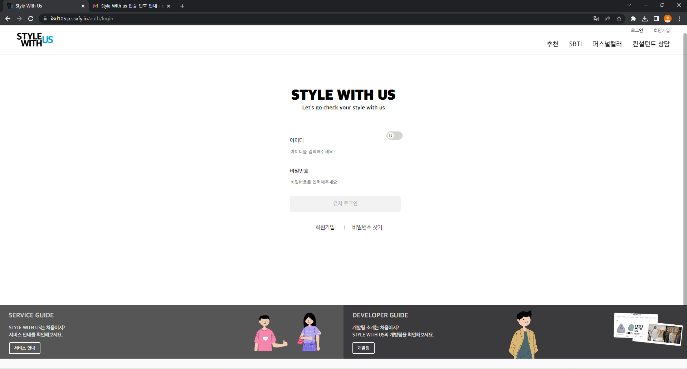
회원으로 로그인 합니다.

### SBTI
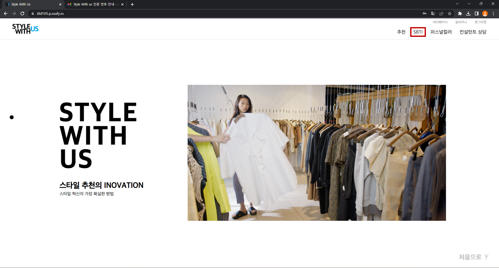

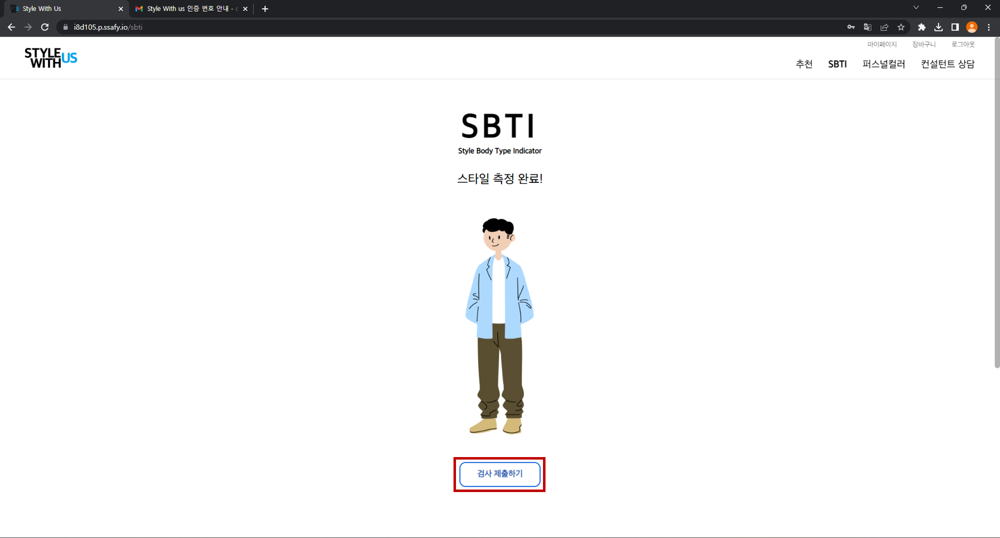
SBTI 페이지를 통해 회원의 체형을 입력합니다.

### 추천 페이지
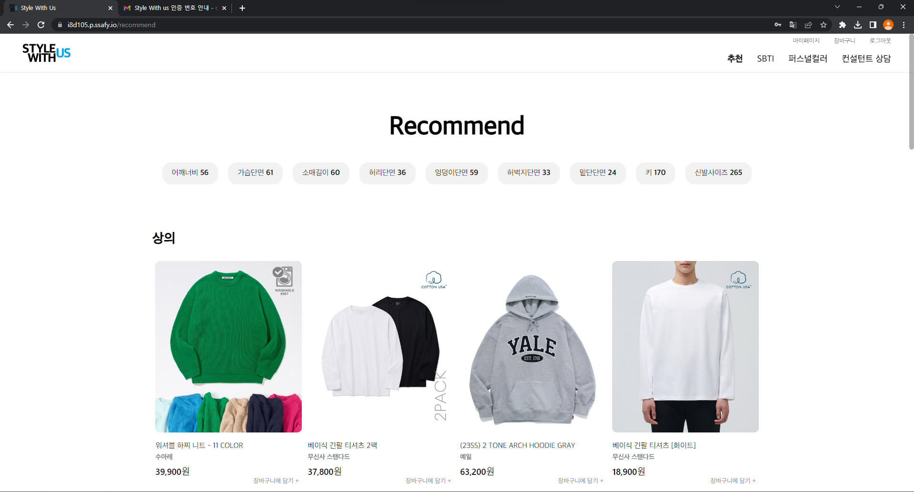
SBTI에 작성한 체형을 바탕으로 옷이 추천됩니다.

### 퍼스널 컬러
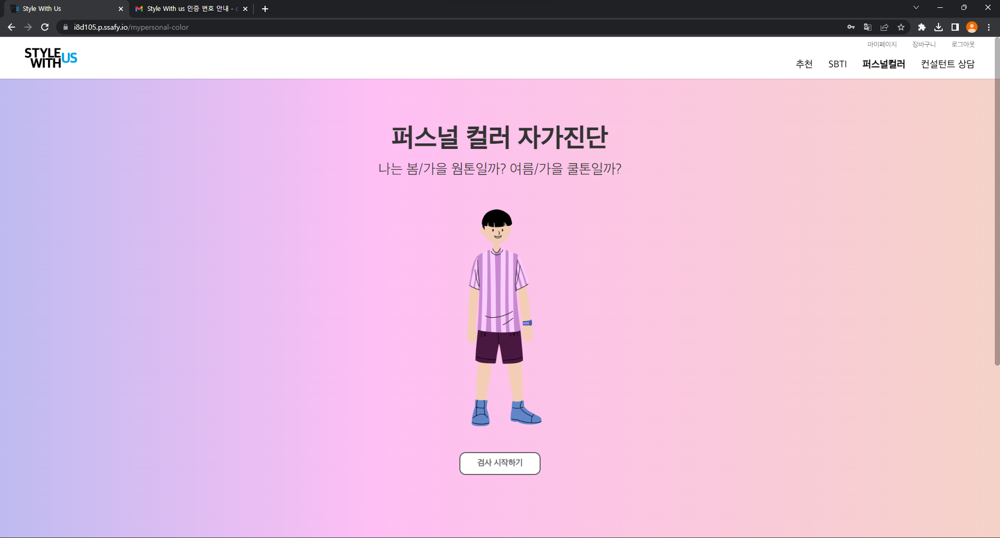

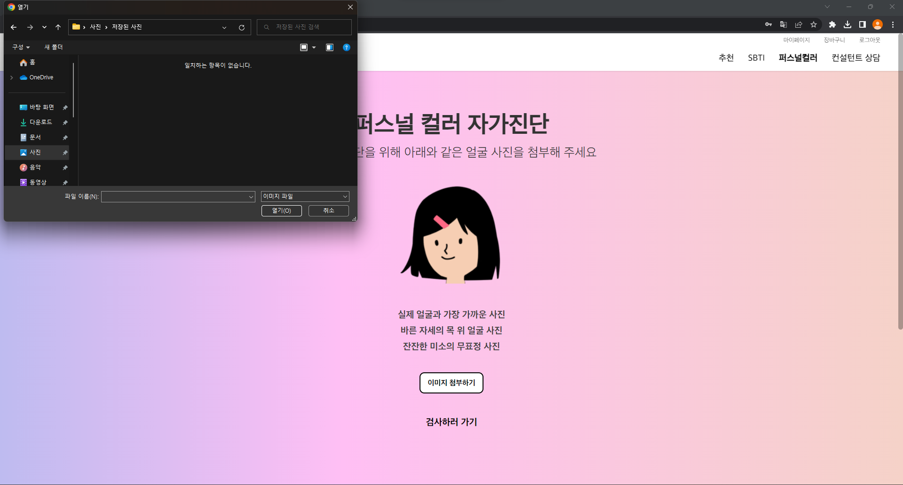
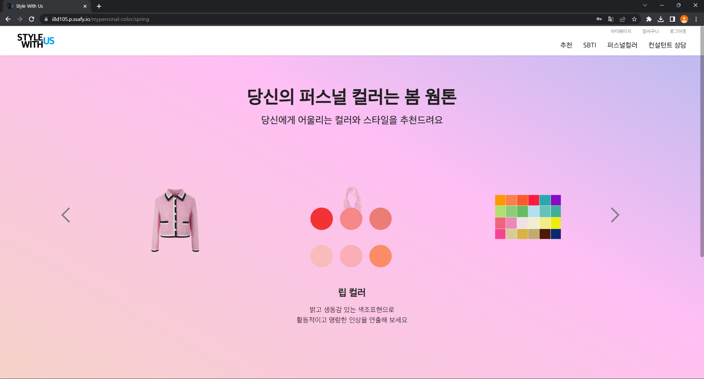
이미지 업로드를 통해 회원의 퍼스널 컬러 자가진단이 가능합니다.

### 컨설턴트 미팅
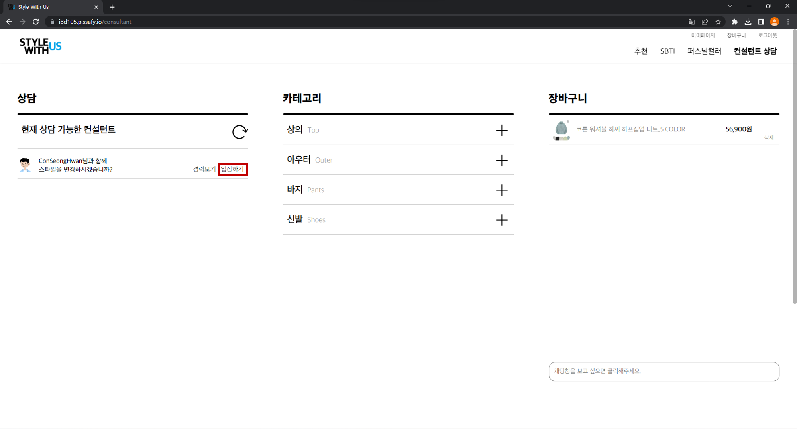
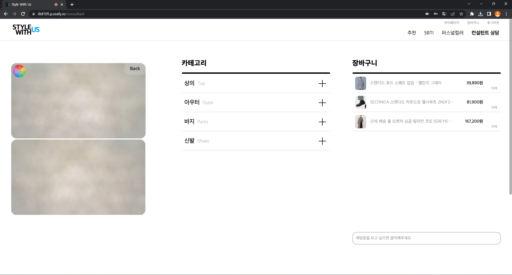
미팅 룸을 열어둔 컨설턴트들 중에서 하나의 컨설턴트를 선택하여 화상 채팅방에 입장이 가능합니다.

##### 시연 시나리오 ➡ [노션 링크](https://www.notion.so/Style-With-US-8902ff3d6a114d15970ea58bfaee6a96)

 

---

 

## DB ERD
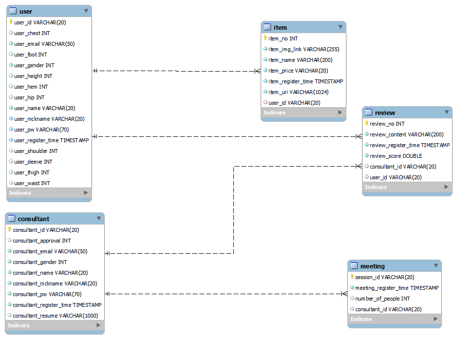

## 팀원 역할
| 이름   | 역할 | 내용                        |
| ------ | ---- | --------------------------- |
| 이병수 | FE | 프론트엔드 개발, 비동기 통신 |
| 양서정 | FE | 프론트엔드 개발, UI/UX 디자인 |
| 이동엽 | FE | 프론트엔드 개발. 채팅 기능 |
| 김현진 | FE | 프론트엔드 개발, Openvidu |
| 박재현 | BE | 백앤드 개발, CI/CD |
| 박성환 | BE | 백앤드 개발, Openvidu |
